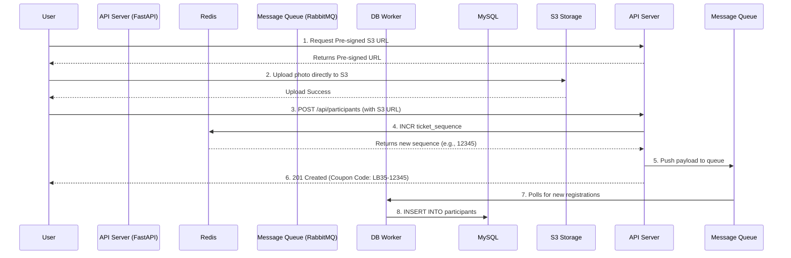

# Architecture Review: High-Concurrency Event Registration

Handling 50,000+ concurrent registration requests within a short 1-5 hour window is a classic high-throughput, bursty write scenario. 

Based on my review of your current `lucky_draw_api` architecture, the current design will likely crash or experience severe timeouts under that level of load. Here is an analysis of the bottlenecks and a proposed highly scalable architecture.

## 🔴 Current Architecture Bottlenecks

1. **Local File Uploads (`aiofiles`)**: 
   The current `/api/participants` route receives the photo bytes and writes them to the local disk. 
   - **Why it's bad:** It makes your API servers **stateful**. You cannot easily add more API servers behind a load balancer because they won't share the same `uploads/` folder. Furthermore, streaming 50,000 images to the API server will quickly exhaust its memory, file descriptors, and network bandwidth.
2. **Double Database Trips & Open Connections**:
   The registration route does a `SELECT` to check if `unique_id` exists, then uploads the file, then does an `INSERT`, and finally does an `UPDATE` to set the `coupon_code` (which depends on an auto-incremented sequence).
   - **Why it's bad:** This keeps the database connection open during the entire file upload process. With 50,000 concurrent users, your database connection pool will be exhausted almost instantly, causing a cascading failure. The initial `SELECT` is also subject to race conditions and is redundant since the database has a `UNIQUE` constraint.
3. **Database Lock Contention**:
   You are relying on MySQL's `autoincrement` to generate the `ticket_sequence` for the coupon code. 
   - **Why it's bad:** At 50,000 concurrent inserts, this auto-increment lock can become a major bottleneck, slowing down all database operations.

---

## 🟢 Proposed Architecture (High Scale)

To survive a 50,000+ concurrent burst, we need to decouple the heavy work (file uploads and DB inserts) from the fast work (validating the request and returning a coupon code).

### 1. Direct-to-Cloud File Uploads (Pre-signed URLs)
Instead of the backend receiving the file, offload this to Cloud Storage (AWS S3, Google Cloud Storage, Cloudflare R2).
* **Flow:** 
  1. The frontend requests a "Pre-signed Upload URL" from the backend.
  2. The frontend uploads the file **directly** to the Cloud Storage bucket (bypassing your backend entirely).
  3. The frontend submits the registration form with the Cloud Storage file URL instead of the file bytes.
* **Benefit:** Saves massive amounts of bandwidth and memory on your API servers.

### 2. Redis for Sequence Generation
Instead of relying on MySQL to generate the `ticket_sequence` and waiting for an `INSERT` to get the `coupon_code`, use **Redis**.
* **Flow:** Use Redis's atomic `INCR ticket_sequence_counter`. Redis can handle 100,000+ increments per second easily.
* **Benefit:** You can generate the `coupon_code` (e.g., `LB35-00412`) instantly in the API without touching MySQL.

### 3. Message Queue (Asynchronous DB Inserts)
Do not write to MySQL synchronously while the user waits.
* **Flow:** 
  1. The API validates the form and gets a ticket sequence from Redis.
  2. The API drops a JSON payload with the user's data into a Message Queue (e.g., RabbitMQ, Redis Streams, or AWS SQS).
  3. The API immediately returns `201 Created` and the `coupon_code` to the user. (Response time: < 50ms)
  4. A fleet of background workers reads from the queue and inserts the data into MySQL at a safe, controlled rate (e.g., 500 inserts/sec).
* **Benefit:** Your database is protected from traffic spikes. Users get an instant response even under extreme load.

### 4. Rely on Database Constraints
Remove the manual `SELECT` check for `unique_id`. Simply attempt the insert (in the background worker) and catch the `IntegrityError` if it violates the unique constraint. If you must reject duplicates synchronously at the API level, cache the registered `unique_id`s in a Redis Set (`SADD registered_ids <id>`) for instant O(1) lookups.

---

## 🏗️ Architecture Diagram

### Next Steps

If you'd like, I can help you implement this. We can start by:
1. Setting up **Redis** for sequence generation.
2. Refactoring the route to use **Pre-signed URLs** for AWS S3/MinIO.
3. Adding a basic **Celery / Redis Queue** for background processing.

What do you think of this approach?
